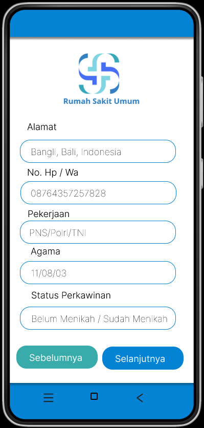
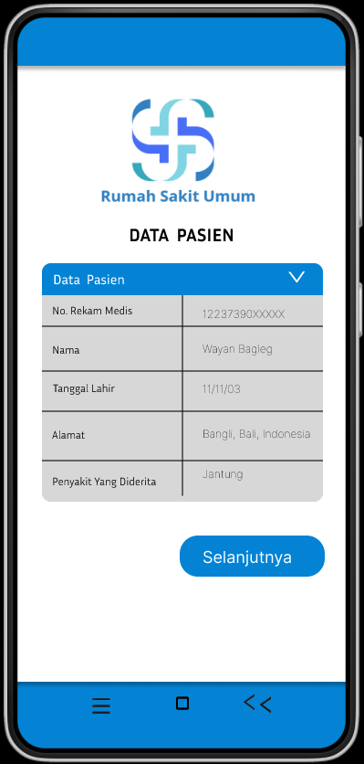
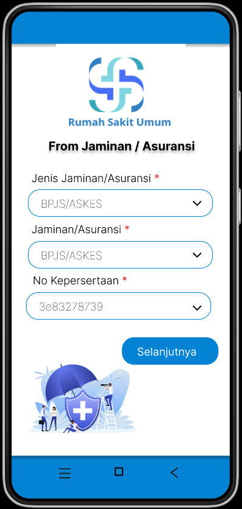
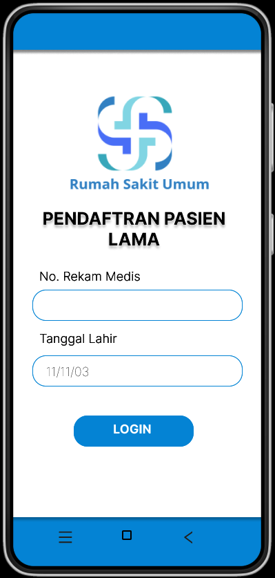
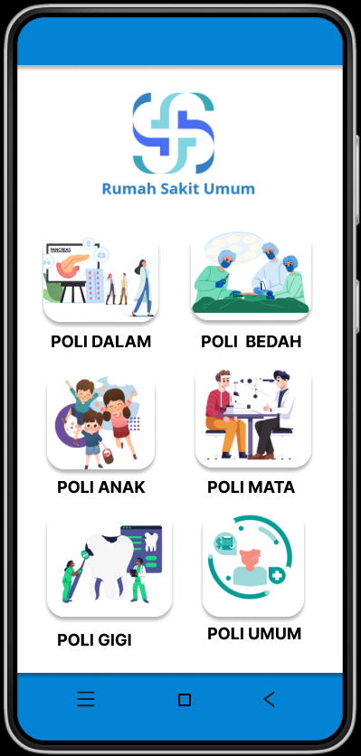
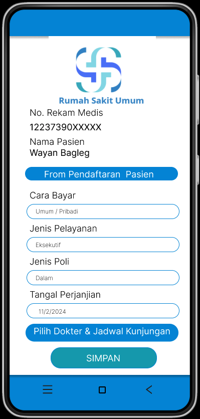

# flutter_application_1

A new Flutter project.

## Getting Started

This project is a starting point for a Flutter application.

A few resources to get you started if this is your first Flutter project:

- [Lab: Write your first Flutter app](https://docs.flutter.dev/get-started/codelab)
- [Cookbook: Useful Flutter samples](https://docs.flutter.dev/cookbook)

For help getting started with Flutter development, view the
[online documentation](https://docs.flutter.dev/), which offers tutorials,
samples, guidance on mobile development, and a full API reference.

# Laporan Projek
# i
Judul: SISTEM RUMAH SAKIT

Projek sistem rumah sakit ini merupakan projek tugas uas Pemrograman Mobile perdana kami
yang terdiri dari 1 buah Post Request dan 2 Get Request yang di implementasikan dengan Firebase
projek ini juga mengimplementasikan akses permission camera dan Lokasi.

# ii
Desain Figma
Desain Figma dari sistem ini dilampirkan pada sebuah folder dengan nama "desain_figma".
Untuk list screenshoot desain bisa dilihat dibawah ini: 

# iii
Pembahasan 

## HALAMAN MAIN.DART

# Komponen Import Paket dan Modul
* Impor Paket:
- import 'package:flutter/material.dart';: intuk mengimport paket Flutter yang menyediakan widget-widget untuk membangun antarmuka pengguna.
- import 'package:firebase_core/firebase_core.dart';: untuk mengimport paket Firebase untuk inisialisasi Firebase dalam sistem yang dibuat.

* Impor Modul:
- import 'firebase_options.dart';: untuk mengimport file konfigurasi Firebase yang berisi pengaturan untuk platform yang digunakan.
- import 'login.dart';: untuk mengimport modul yang berisi definisi halaman login.
- import 'table.dart';: untuk mengimport modul yang berisi definisi halaman tabel.

# Komponen Main
- void main() async: merupakan fungsi utama yang menjadi titik awal eksekusi aplikasi.
- WidgetsFlutterBinding.ensureInitialized();: untuk memastikan bahwa binding widget Flutter telah diinisialisasi sebelum melakukan operasi lainnya, seperti operasi asinkron di fungsi main.
- await Firebase.initializeApp(...): menginisialisasi Firebase dengan menggunakan opsi konfigurasi agar memungkinkan aplikasi untuk menggunakan fitur-fitur Firebase.
- runApp(MyApp());: menjalankan aplikasi Flutter dengan MyApp sebagai widget utama.

# Komponen MyApp
- class MyApp extends StatelessWidget: MyApp merupakan turunan dari StatelessWidget, jadi widget ini bersifat statis dan tidak memiliki state yang dapat berubah.
- Widget build(BuildContext context): digunakan untuk membangun dan mengembalikan antarmuka pengguna sistem.
- return MaterialApp(...): mengembalikan sebuah MaterialApp, yang merupakan widget utama aplikasi Flutter yang menyediakan fitur seperti tema, routing, dan navigasi.
- home: Login(): digunakan untuk menentukan halaman utama dari sistem sebagai halaman login.
- routes:  menavigasi antar halaman dalam sistem yang sudah dipetakan ke widget yang sesuai.
- '/Halsatu': (BuildContext context) => Login(),: mendefinisikan rute '/Halsatu' yang mengarahkan ke halaman Login.
- '/Tabel': (BuildContext context) => Tabelne(),: mendefinisikan rute '/Tabel' yang mengarahkan ke halaman Tabelne.

## HALAMAN LOGIN.DART

# Komponen Import Paket dan Modul
* Impor Modul:
- import 'package:flutter_application_1/Haldua.dart';: mengimport modul yang berisi definisi halaman Haldua.
- import 'package:flutter_application_1/Haltiga.dart';: mengimport modul yang berisi definisi halaman Haltiga.

# Komponen Scaffold
- Scaffold: merupakan widget dasar yang menyediakan struktur dasar untuk aplikasi, termasuk app bar, body, dll.
- AppBar: mweupakan widget yang menampilkan bar aplikasi di bagian atas layar.
- backgroundColor: berfungsi set warna latar belakang untuk AppBar.
- title: merupakan judul yang ditampilkan di AppBar.

# Komponen SingleChildScrollView
- SingleChildScrollView: merupakan widget yang memungkinkan tampilan untuk di-scroll ketika konten lebih besar dari ukuran layar.
- Column: merupakan widget yang mengatur widget anak-anaknya dalam tata letak vertikal.
- crossAxisAlignment: CrossAxisAlignment.center: digunakan untuk mengatur agar widget anak-anak disejajarkan di tengah secara horizontal.

# Komponen ontainer untuk gambar
- Container: merupakan widget kotak yang dapat digunakan untuk mengatur tata letak, seperti padding, margin, ukuran, dan lainnya.
- Image.asset: digunakan untuk menampilkan gambar dari direktori aset.

# Komponen InkWell untuk Interaksi
- InkWell: merupakan widget yang merespons interaksi pengguna, seperti ketukan.
- onTap: merupakan fungsi callback yang dipanggil saat widget diketuk.
- Navigator.push: untuk mengganti halaman saat ini dengan halaman Haldua.
- Card: merupakan widget yang menampilkan kartu material.
- Container: digunakan untuk menyediakan ukuran dan padding untuk konten kartu.
- Column: menyusun widget anak-anaknya dalam tata letak vertikal.
- Image.asset: digunakan untuk menampilkan gambar dari direktori aset.
- Text: digunakan untuk menampilkan teks dengan gaya yang ditentukan.

# Komponen Container untuk informasi Kontak
- Container: merupakan widget kotak untuk mengatur tata letak.
- padding: digunakan untuk menambahkan ruang di sekitar konten.
- Row: merupakan widget yang menyusun widget anak-anaknya dalam tata letak horizontal.
- mainAxisAlignment: MainAxisAlignment.center: digunakan untuk menyusun widget anak-anak di tengah secara horizontal.
- Text: digunakan menampilkan teks.
- Icon: digunakan menampilkan ikon.
- SizedBox: untuk menambahkan ruang kosong dengan ukuran tertentu.

## HALAMAN LOGIN.DART

# Komponen Import Paket dan Modul
* Impor Modul:
- import 'package:flutter_application_1/map.dart';: mengimport modul yang berisi definisi halaman SimpleMapPage.
- import 'package:flutter_application_1/Hallima.dart';: mengimport modul yang berisi definisi halaman Hallima.

# Komponen class Tabelne
- Tabelne: merupakan kelas yang merupakan turunan dari StatelessWidget, jadi widget ini bersifat statis dan tidak memiliki state yang dapat berubah.
- build(BuildContext context): merupakan metode build yang digunakan untuk membangun dan mengembalikan tampilan widget dari sistem.
- final List<Map<String, dynamic>> dataList: digunakan untuk mengambil data yang dikirim melalui Navigator dan disimpan dalam variabel dataList.

# Komponen Scaffold
- Scaffold: merupakan widget dasar yang menyediakan struktur dasar untuk aplikasi, termasuk app bar, body, dll.
- AppBar: merupakan widget yang menampilkan bar aplikasi di bagian atas layar.
- backgroundColor: warna latar belakang untuk AppBar.
- title: Judul yang ditampilkan di AppBar.

# Komponen ListView.builder
- ListView.builder: merupakan widget yang membangun list secara dinamis berdasarkan jumlah item yang ditentukan.
- itemCount: jumlah item yang akan ditampilkan dalam list, dimana ditambah satu untuk kartu tambahan.
- itemBuilder: merupakan fungsi yang dipanggil untuk membangun setiap item dalam list berdasarkan index.

# Komponen Data Pasien
- Padding: digunakan untuk menambahkan padding di sekitar widget anak.
- Card: digunakan untuk menampilkan kartu material dengan elevasi.
- DataRowItem: merupakan widget khusus yang digunakan untuk menampilkan baris data pasien.
- label: label untuk data pasien.
- value: nilai data pasien yang ditampilkan.

# Komponen Lokasi Pasien
- InkWell: merupakan widget yang merespons interaksi pengguna, seperti ketukan.
- onTap: merupakan fungsi callback yang dipanggil saat widget diketuk.
- Navigator.push: digunakan mengganti halaman saat ini dengan halaman SimpleMapPage.
- Card: digunakan untuk menampilkan kartu material dengan elevasi.
- Padding: menyediakan padding di sekitar konten kartu.
- Text: menampilkan teks dengan gaya yang ditentukan.
- Image.asset: untuk menampilkan gambar dari direktori aset.

# Komponen Padding
- Padding: digunakan untuk menambahkan padding di sekitar widget anak.
- Center: digunakan menyusun widget anak di tengah secara horizontal.
- ElevatedButton: tombol material yang menonjol.
- onPressed: merupakan fungsi callback yang dipanggil saat tombol ditekan.
- Navigator.push: digunakan mengganti halaman saat ini dengan halaman Hallima.

# Komponen DataRowItem
- DataRowItem: merupakan kelas khusus yang digunakan untuk menampilkan baris data pasien.
- label: label untuk data pasien.
- value: nilai data pasien yang ditampilkan.
- build(BuildContext context): merupakan metode untuk membangun dan mengembalikan tampilan widget yang terdiri dari label dan nilai data pasien.

## HALAMAN HALDUA.DART

# Komponen Import Paket dan Modul
* Impor Paket:
- import 'package:firebase_database/firebase_database.dart';: mengimport paket untuk berinteraksi dengan Firebase Realtime Database.

* Impor Modul:
- import 'package:flutter_application_1/Hallima.dart';: mengimport modul yang berisi definisi halaman Hallima.
- import 'package:flutter_application_1/camera.dart';: mengimport modul yang berisi definisi halaman Camera.

# Komponen Kelas Haldua
- Haldua: merupakan sebuah kelas yang merupakan turunan dari StatelessWidget, jadi widget ini bersifat statis dan tidak memiliki state yang dapat berubah.
- Controller: TextEditingController: digunakan mengontrol dan mengelola teks yang diinput oleh pengguna di berbagai TextField.

# Komponen _saveToFirebase
- _saveToFirebase: merupakan fungsi untuk menyimpan data ke Firebase Realtime Database.
- DatabaseReference dbRef: referensi ke lokasi di database.
- dbRef.push().key: menghasilkan kunci unik untuk setiap data baru.
- dbRef.child(id!).set: menyimpan data ke lokasi yang dihasilkan oleh kunci.

# Komponen mMetode Build
- Scaffold: merupakan widget dasar yang menyediakan struktur dasar untuk sistem, termasuk app bar dan body.
- AppBar: merupakan widget yang menampilkan bar aplikasi di bagian atas layar.
- title: judul yang ditampilkan di AppBar.
- backgroundColor: warna latar belakang untuk AppBar.
- Container: merupakan widget yang membungkus dan mengatur tata letak widget anak.
- padding: menambahkan padding di sekitar konten.
- Column: widget yang menyusun widget anak dalam satu kolom vertikal.
- Image.asset: untuk menampilkan gambar dari direktori aset.

# Komponen TextField untuk Input Data
- TextField: merupakan widget yang memungkinkan pengguna untuk memasukkan teks.
- controller: menghubungkan TextField dengan TextEditingController yang sesuai.
- decoration: untuk mengatur dekorasi TextField, seperti hintText yang memberikan petunjuk kepada pengguna tentang data yang harus dimasukkan.

# Komponen Tombol Aksi
- SizedBox: untuk menambahkan ruang kosong di antara widget.
- Row: menyusun widget anak dalam satu baris horizontal.
- mainAxisAlignment: MainAxisAlignment.spaceEvenly: menyusun widget anak dengan jarak yang merata di antara mereka.
- ElevatedButton: tombol material yang menonjol.
- onPressed: merupakan fungsi callback yang dipanggil saat tombol ditekan.
Mengambil nilai dari TextEditingController: mengambil data dari input pengguna.
- Memanggil _saveToFirebase: untuk menyimpan data ke Firebase.
- showDialog: berfungsi menampilkan dialog untuk memberi tahu pengguna bahwa pendaftaran berhasil.
- Navigasi ke Hallima: digunakan untuk pindah ke halaman berikutnya (Hallima).
- Navigasi ke CameraScreen: digunakan untuk pindah ke halaman kamera (Camera).

## HALAMAN HALTIGAS.DART

# Komponen Import Paket dan Modul
* Impor Paket:
- import 'package:flutter/material.dart';: digunakan untuk mengimpor paket Flutter yang menyediakan widget dasar untuk membangun antarmuka pengguna.
- import 'package:firebase_database/firebase_database.dart';: digunakan untuk mengimpor paket untuk berinteraksi dengan Firebase Realtime Database.

# Komponen Kelas Haltiga dan State-nya
- Haltiga: merupakan widget Stateful yang berfungsi sebagai halaman untuk verifikasi pasien.
- _HaltigaState: kelas state yang terkait dengan widget Haltiga.
- TextEditingController: digunakan mengontrol dan mengelola input teks dari pengguna untuk NIK dan Tanggal Lahir.

# Komponen Fungsi _verifyUser
- _verifyUser: berfungsi untuk memverifikasi pengguna berdasarkan NIK dan Tanggal Lahir di Firebase Realtime Database.
- DatabaseReference dbRef: referensi ke Firebase Realtime Database.
- DataSnapshot snapshot: snapshot dari data yang diambil dari Firebase.
- Iterasi dan Verifikasi: digunakan untuk mengecek apakah pengguna dengan NIK dan Tanggal Lahir yang cocok ada di database.

# Komponen Fungsi _login
- _login: Fungsi yang dipanggil saat pengguna menekan tombol "Login". 
Lalu akan:
- Mengambil nilai NIK dan Tanggal Lahir dari TextEditingController.
- Memanggil _verifyUser untuk memverifikasi pengguna.
- Jika verifikasi gagal, menampilkan dialog notifikasi kepada pengguna.

# Komponen Metode build
- build: metode yang membangun UI untuk widget Haltiga.
- Scaffold: struktur dasar halaman dengan app bar dan body.
- AppBar: menampilkan judul halaman dan mengatur warna latar belakang.
- Container: membungkus dan mengatur tata letak konten.
- TextField:merupakan widget untuk input teks oleh pengguna.
- ElevatedButton: tombol aksi untuk memulai proses login.

## HALAMAN HALLIMA.DART

# Komponen Import Paket dan Modul
* Impor Paket:
- import 'package:flutter/material.dart';: untuk mengimport paket Flutter yang menyediakan widget-widget untuk membangun antarmuka pengguna.

# Komponen Kelas Hallima
- Scaffold: mendefinisikan struktur dasar halaman dengan app bar dan body.
- AppBar: menampilkan judul halaman "Jenis Penyakit" dengan warna latar belakang yang ditentukan.
- body: bagian utama dari halaman yang berisi konten.
- Container dan Center: mengelompokkan dan memusatkan konten di tengah halaman.
- Column: mengatur konten secara vertikal.
- Image.asset: menampilkan gambar dari file lokal.
- Card dan Container: menggunakan Card sebagai wadah untuk konten dengan Container yang memiliki padding dan ukuran tertentu.
- Row dan Column dalam Container: mengatur kartu-kartu jenis penyakit secara horizontal dan vertikal.
- Text: menampilkan teks dengan gaya tertentu (misalnya, ukuran font).

## HALAMAN CAMERA.DART

# Komponen Import Paket
import 'package:flutter/material.dart';: untuk mengimport paket Flutter yang menyediakan widget-widget untuk membangun antarmuka pengguna.
import 'package:camera/camera.dart';: untuk mengimport paket Flutter yang menyediakan fitur kamera perangkat dan mengambil gambar dari dalam sistem.

# Komponen Kelas CameraScreen
- CameraScreen: merupakan stateful widget yang akan menampilkan layar kamera.

# Komponen State _CameraPageState
- CameraController: mengontrol kamera untuk menangkap gambar atau video.
- availableCameras(): mengambil daftar kamera yang tersedia pada perangkat.
- initState(): merupakan metode siklus hidup widget untuk menginisialisasi kamera saat widget dibuat.
- _initializeCamera(): merupaka metode async untuk menginisialisasi kamera, termasuk memilih kamera pertama yang tersedia.
- dispose(): merupakan metode siklus hidup widget untuk membersihkan sumber daya ketika widget dihapus.
- CameraPreview: merupakan widget yang menampilkan tampilan pratinjau dari kamera.
- Stack dan Positioned: digunakan untuk mengatur tata letak pratinjau kamera dan tombol tangkapan gambar di atasnya.
- FloatingActionButton: merupakan tombol aksi untuk menangkap gambar dari kamera.
- _captureImage(): metode yang akan menangani pengambilan gambar dari kamera.

## HALAMAN MAP.DART

# Komponen Import Paket
- import 'package:flutter/material.dart';: untuk mengimport paket Flutter yang menyediakan widget-widget untuk membangun antarmuka pengguna.
- import 'package:flutter_map/flutter_map.dart';: untuk mengimport paket yang memungkinkan menampilkan peta.
- import 'package:latlong2/latlong.dart';: untuk mengimport paket yang berfungsi menangani koordinat.
- import 'package:package:geolocator/geolocator.dart': untuk mengimport paket yang memungkinjan mendapatkan lokasi terkini dari perangkat.

# Komponen Kelas SimpleMapPage
- SimpleMapPage: merupakan stateful widget yang akan menampilkan peta dan mengelola status peta.

# Komponen State _SimpleMapPageState
- MapController: digunakan mengontrol perilaku peta seperti pengaturan tampilan dan zoom.
- LatLng: representasi koordinat (latitude dan longitude).
- _getCurrentLocation(): merupakan metode async untuk mendapatkan lokasi terkini pengguna menggunakan Geolocator, termasuk penanganan izin lokasi.
- FlutterMap: widget utama yang menampilkan peta dengan MapOptions untuk mengatur tampilan awal peta.
- TileLayer: layer untuk menampilkan tile peta dari OpenStreetMap sebagai background peta.
- MarkerLayer: layer untuk menambahkan marker atau penanda pada peta, dalam hal ini menandai lokasi pengguna.
- Marker: objek yang merepresentasikan marker pada peta dengan ikon Icons.location_pin berwarna merah.
- Scaffold dan AppBar: menyediakan struktur dasar dan app bar untuk halaman peta.

## HALAMAN FIREBASE_OPTIONS.DART

# Komponen Import Paket
- import 'package:firebase_core/firebase_core.dart';: mengimport paket untuk mengakses FirebaseOptions.
- import 'package:flutter/foundation.dart';: mengimport paket untuk akses informasi dari platform seperti defaultTargetPlatform dan kIsWeb.

# Komponen Kelas DefaultFirebaseOptions
- currentPlatform: merupakan metode statis yang mengembalikan FirebaseOptions berdasarkan platform saat ini.
- Konfigurasi FirebaseOptions:
    web: Opsi untuk aplikasi web.
    android: Opsi untuk aplikasi Android.
    ios: Opsi untuk aplikasi iOS.
    macos: Opsi untuk aplikasi macOS.
    windows: Opsi untuk aplikasi Windows.

# iv
Petunjuk instalasi
## 1. Prasyarat
- Pastikan Flutter SDK sudah terinstall pada komputer anda.
- Perlu memiliki akun Firebase dan mengikuti langkah-langkah yang diberikan untuk integrasi.

## 2. Konfigurasi Firebase
- Ikuti petunjuk yang diberikan Firebase, yang akan memandu untuk konfigurasi 'google-services.json'.
- Pastikann file 'firebase_options.dart' telah terkonfigurasi.

## 3. Instalasi Paket Dependensi
- Buka terminal pada direktori proyek Flutter, lalu jalankan code 'flutter pub get' untuk instalasi paket dalam 'pubspec.yaml.

## 4. Pengujian 
- Jalankan sistem dengan code 'flutter run' pada terminal.
- Lakukan pengujian pada fitur yang tersedia baik kamera, maps, dan Firebase nya.
